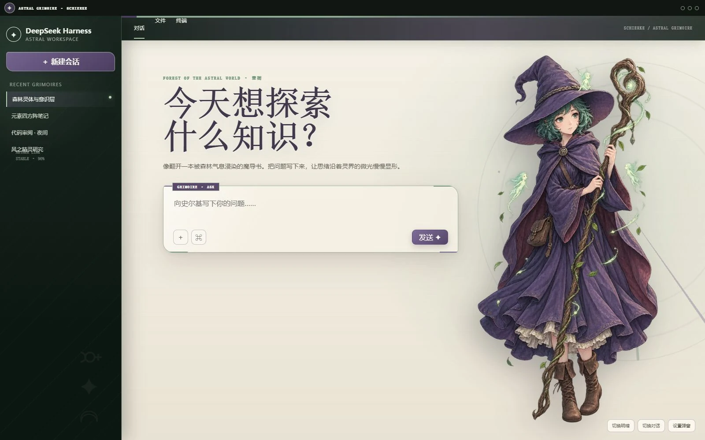
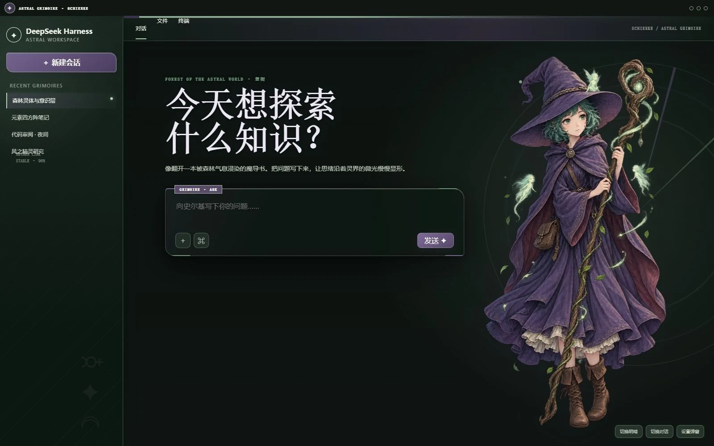

# dsh-skin-schierke

史尔基主题的 DSH Web UI 全界面皮肤。羊皮纸浅色模式与深林夜色暗色模式共享紫袍、森之灵、手绘法阵与魔导书装帧语言；欢迎页展示完整角色立绘，对话开始后自动弱化并退让阅读区。

| Light | Dark |
| --- | --- |
|  |  |

## Visual system

- Light: parchment ivory, faded sage, heather violet, ink brown
- Dark: astral forest, moonlit jade, muted violet, warm ivory text
- Signature: restrained grimoire rings, botanical marks, stitched edge details
- Artwork: bundled local WebP with full-body bounds-safe placement and active-chat de-emphasis

## Install

```sh
dsh plugin --profile web add https://github.com/unpain/dsh-skin-schierke.git
```

Select **Schierke Astral Grimoire** under `Settings > Skins`.

## Develop

```sh
pnpm install --config.auto-install-peers=false
pnpm assets:embed
pnpm build
node node_modules/vitest/vitest.mjs run
```

The generated character artwork is original project-local fan art. See `NOTICE` for provenance.
