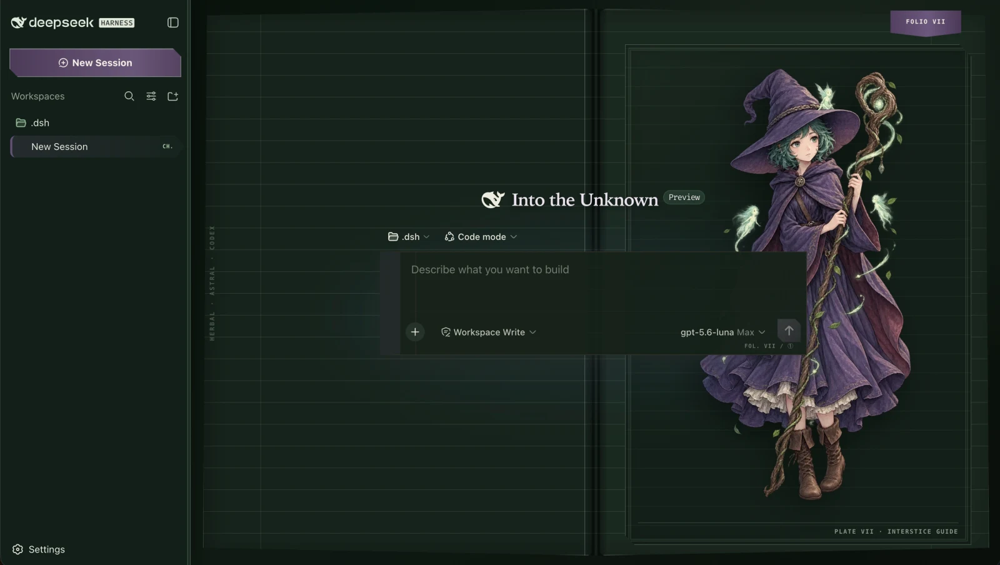
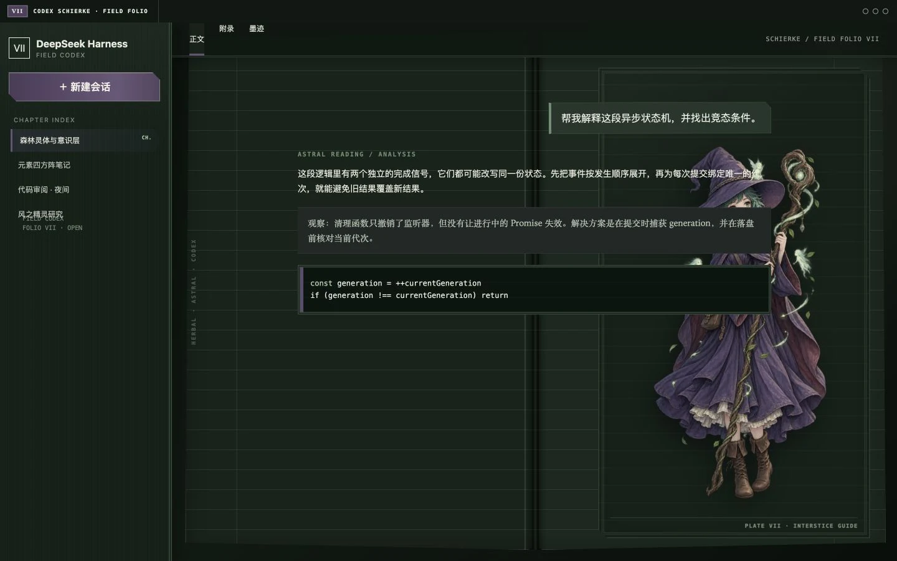
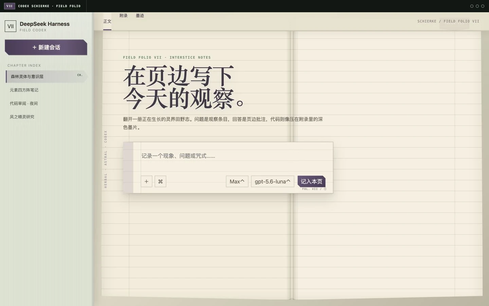

# dsh-skin-schierke

史尔基主题的 DSH Web UI 全界面皮肤。界面被重构为一册摊开的灵界田野志：侧栏是布面章节索引，Composer 是带页边线的观察条，消息、推理、代码和设置分别成为页边批注、脚注、墨块与附录页。



## Interface states

| Light | Dark |
| --- | --- |
|  |  |

| Active chat | No artwork |
| --- | --- |
|  |  |

## Visual system

- Light: bone paper, faded sage, heather violet, umber ink
- Dark: nocturnal paper, moonlit jade, muted violet, warm ivory type
- Structure: open double-page spread, central gutter, vertical marginalia, chapter bookmarks
- Components: ruled observation-slip Composer, marginal-note messages, footnote reasoning, ink-block code, appendix dialogs
- Artwork: bundled local WebP contained in an illustrated folio plate; it fades during active chat and can be removed without erasing the skin's identity

The visual rationale, rejected directions, identity axes, artwork policy, and comparison baseline live in [`design-brief.md`](design-brief.md).

## Install

```sh
dsh plugin --profile web add https://github.com/unpain/dsh-skin-schierke.git
```

Select **Schierke Astral Grimoire** under `Settings > Skins`.

## Develop

```sh
pnpm install --config.auto-install-peers=false
pnpm assets:embed
pnpm build
node node_modules/vitest/vitest.mjs run
```

The generated character artwork is original project-local fan art. See `NOTICE` for provenance.
